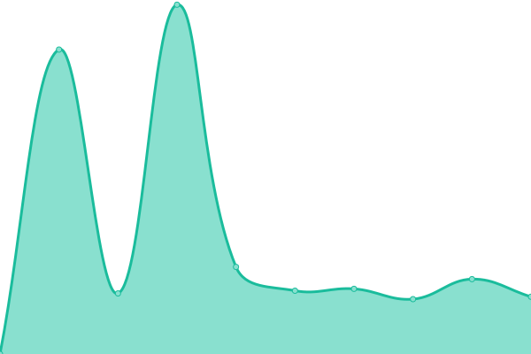
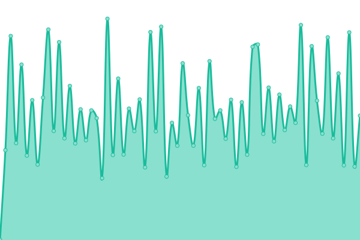
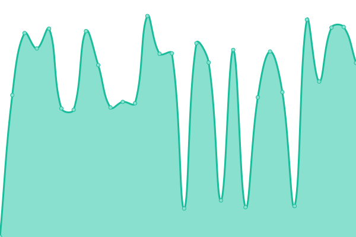
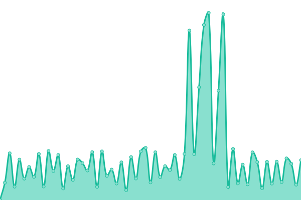
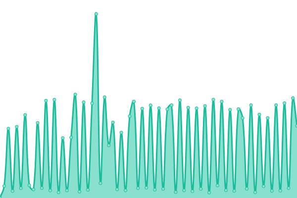
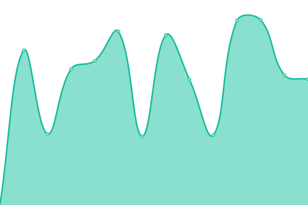
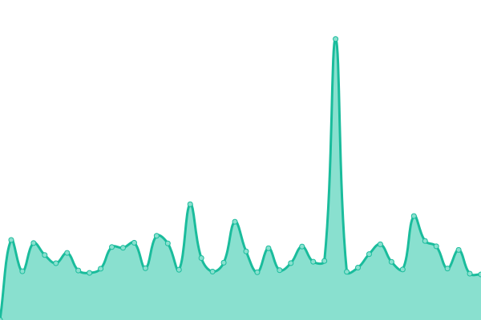
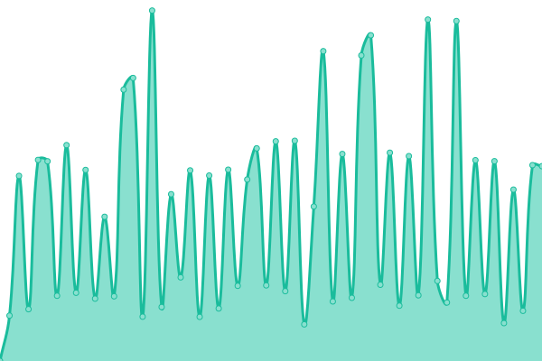

# [📈 Live Status](https://glefait.github.io/martinique-public-websites): <!--live status--> **🟧 Partial outage**

This repository contains the open-source uptime monitor and status page for [Guillem Lefait](https://guillem.lefait.fr), powered by [Upptime](https://github.com/upptime/upptime).

With [Upptime](https://upptime.js.org), you can get your own unlimited and free uptime monitor and status page, powered entirely by a GitHub repository. We use [Issues](https://github.com/glefait/martinique-public-websites/issues) as incident reports, [Actions](https://github.com/glefait/martinique-public-websites/actions) as uptime monitors, and [Pages](https://glefait.github.io/martinique-public-websites) for the status page.

<!--start: status pages-->
<!-- This summary is generated by Upptime (https://github.com/upptime/upptime) -->
<!-- Do not edit this manually, your changes will be overwritten -->
<!-- prettier-ignore -->
| URL | Status | History | Response Time | Uptime |
| --- | ------ | ------- | ------------- | ------ |
|  [CTM](https://www.collectivitedemartinique.mq) | 🟩 Up | [ctm.yml](https://github.com/glefait/martinique-public-websites/commits/HEAD/history/ctm.yml) | 

 1720ms
     
 | 

<a href="https://guillem.lefait.fr/history/ctm">99.27%</a>
    

|  [CACEM](https://www.cacem.fr) | 🟩 Up | [cacem.yml](https://github.com/glefait/martinique-public-websites/commits/HEAD/history/cacem.yml) | 

 932ms
     
 | 

<a href="https://guillem.lefait.fr/history/cacem">91.35%</a>
    

|  [Espace Sud](http://espacesud.fr) | 🟩 Up | [espace-sud.yml](https://github.com/glefait/martinique-public-websites/commits/HEAD/history/espace-sud.yml) | 

 4245ms
     
 | 

<a href="https://guillem.lefait.fr/history/espace-sud">88.79%</a>
    

|  [Cap Nord](http://www.capnordmartinique.fr) | 🟩 Up | [cap-nord.yml](https://github.com/glefait/martinique-public-websites/commits/HEAD/history/cap-nord.yml) | 

 808ms
     
 | 

<a href="https://guillem.lefait.fr/history/cap-nord">99.58%</a>
    

|  [Fort-de-France](https://www.fortdefrance.fr) | 🟩 Up | [fort-de-france.yml](https://github.com/glefait/martinique-public-websites/commits/HEAD/history/fort-de-france.yml) | 

 3023ms
     
 | 

<a href="https://guillem.lefait.fr/history/fort-de-france">94.49%</a>
    

|  [Schoelcher](https://www.mairie-schoelcher.fr) | 🟩 Up | [schoelcher.yml](https://github.com/glefait/martinique-public-websites/commits/HEAD/history/schoelcher.yml) | 

 1868ms
     
 | 

<a href="https://guillem.lefait.fr/history/schoelcher">91.38%</a>
    

|  [Saint-Joseph](https://saintjoseph972.com) | 🟩 Up | [saint-joseph.yml](https://github.com/glefait/martinique-public-websites/commits/HEAD/history/saint-joseph.yml) | 

 1387ms
     
 | 

<a href="https://guillem.lefait.fr/history/saint-joseph">0.00%</a>
    

|  [Le Lamentin](http://www.mairie-lelamentin.fr) | 🟩 Up | [le-lamentin.yml](https://github.com/glefait/martinique-public-websites/commits/HEAD/history/le-lamentin.yml) | 

 2621ms
     
 | 

<a href="https://guillem.lefait.fr/history/le-lamentin">91.36%</a>
    

|  [Sainte-Luce](https://www.sainteluce.fr) | 🟩 Up | [sainte-luce.yml](https://github.com/glefait/martinique-public-websites/commits/HEAD/history/sainte-luce.yml) | 

 758ms
     
 | 

<a href="https://guillem.lefait.fr/history/sainte-luce">0.00%</a>
    

|  [La Trinite](https://www.mairie-latrinite.fr) | 🟥 Down | [la-trinite.yml](https://github.com/glefait/martinique-public-websites/commits/HEAD/history/la-trinite.yml) | 

 644ms
     
 | 

<a href="https://guillem.lefait.fr/history/la-trinite">0.00%</a>
    

|  [Le Vauclin](http://ville-vauclin.fr) | 🟩 Up | [le-vauclin.yml](https://github.com/glefait/martinique-public-websites/commits/HEAD/history/le-vauclin.yml) | 

 1518ms
     
 | 

<a href="https://guillem.lefait.fr/history/le-vauclin">0.00%</a>
    

|  [Riviere-Pilote](https://rivierepilote.fr) | 🟩 Up | [riviere-pilote.yml](https://github.com/glefait/martinique-public-websites/commits/HEAD/history/riviere-pilote.yml) | 

 1979ms
     
 | 

<a href="https://guillem.lefait.fr/history/riviere-pilote">0.00%</a>
    

|  [Riviere-Salee](http://riviere-salee.fr) | 🟩 Up | [riviere-salee.yml](https://github.com/glefait/martinique-public-websites/commits/HEAD/history/riviere-salee.yml) | 

 1295ms
     
 | 

<a href="https://guillem.lefait.fr/history/riviere-salee">44.29%</a>
    

|  [Saint-Pierre](https://saintpierre-mq.fr) | 🟩 Up | [saint-pierre.yml](https://github.com/glefait/martinique-public-websites/commits/HEAD/history/saint-pierre.yml) | 

 1825ms
     
 | 

<a href="https://guillem.lefait.fr/history/saint-pierre">100.00%</a>
    

|  [Les Anses d Arlet](https://ville-ansesdarlet.fr) | 🟩 Up | [les-anses-d-arlet.yml](https://github.com/glefait/martinique-public-websites/commits/HEAD/history/les-anses-d-arlet.yml) | 

 510ms
     
 | 

<a href="https://guillem.lefait.fr/history/les-anses-d-arlet">100.00%</a>
    

|  [Trois-Ilets](https://villedestroisilets.com) | 🟩 Up | [trois-ilets.yml](https://github.com/glefait/martinique-public-websites/commits/HEAD/history/trois-ilets.yml) | 

 746ms
     
 | 

<a href="https://guillem.lefait.fr/history/trois-ilets">100.00%</a>
    

|  [Le Carbet](https://www.villeducarbet.fr) | 🟩 Up | [le-carbet.yml](https://github.com/glefait/martinique-public-websites/commits/HEAD/history/le-carbet.yml) | 

 1045ms
     
 | 

<a href="https://guillem.lefait.fr/history/le-carbet">99.74%</a>
    

|  [Le Lorrain](https://villedulorrain.com) | 🟥 Down | [le-lorrain.yml](https://github.com/glefait/martinique-public-websites/commits/HEAD/history/le-lorrain.yml) | 

 118ms
     
 | 

<a href="https://guillem.lefait.fr/history/le-lorrain">0.00%</a>
    

|  [Le Francois](https://www.ville-francois.fr) | 🟩 Up | [le-francois.yml](https://github.com/glefait/martinique-public-websites/commits/HEAD/history/le-francois.yml) | 

 1712ms
     
 | 

<a href="https://guillem.lefait.fr/history/le-francois">100.00%</a>
    

|  [Le Robert](https://www.ville-robert.fr) | 🟩 Up | [le-robert.yml](https://github.com/glefait/martinique-public-websites/commits/HEAD/history/le-robert.yml) | 

 3822ms
     
 | 

<a href="https://guillem.lefait.fr/history/le-robert">100.00%</a>
    

|  [Sainte-Marie](https://www.ville-saintemarie.fr) | 🟩 Up | [sainte-marie.yml](https://github.com/glefait/martinique-public-websites/commits/HEAD/history/sainte-marie.yml) | 

 889ms
     
 | 

<a href="https://guillem.lefait.fr/history/sainte-marie">100.00%</a>
    

|  [Case-Pilote](https://mairiecasepilote.fr) | 🟩 Up | [case-pilote.yml](https://github.com/glefait/martinique-public-websites/commits/HEAD/history/case-pilote.yml) | 

 1489ms
     
 | 

<a href="https://guillem.lefait.fr/history/case-pilote">81.89%</a>
    

|  [Morne-Vert](https://www.morne-vert.fr) | 🟩 Up | [morne-vert.yml](https://github.com/glefait/martinique-public-websites/commits/HEAD/history/morne-vert.yml) | 

 3117ms
     
 | 

<a href="https://guillem.lefait.fr/history/morne-vert">0.00%</a>
    

|  [Comite Martiniquais du tourisme](https://www.martinique.org) | 🟩 Up | [comite-martiniquais-du-tourisme.yml](https://github.com/glefait/martinique-public-websites/commits/HEAD/history/comite-martiniquais-du-tourisme.yml) | 

 2087ms
     
 | 

<a href="https://guillem.lefait.fr/history/comite-martiniquais-du-tourisme">99.59%</a>
    

|  [Martinique Transport](http://www.martiniquetransport.mq) | 🟩 Up | [martinique-transport.yml](https://github.com/glefait/martinique-public-websites/commits/HEAD/history/martinique-transport.yml) | 

 1322ms
     
 | 

<a href="https://guillem.lefait.fr/history/martinique-transport">99.39%</a>
    

|  [Observatoire Eau Martinique](https://www.observatoire-eau-martinique.fr) | 🟥 Down | [observatoire-eau-martinique.yml](https://github.com/glefait/martinique-public-websites/commits/HEAD/history/observatoire-eau-martinique.yml) | 

 926ms
     
 | 

<a href="https://guillem.lefait.fr/history/observatoire-eau-martinique">50.74%</a>
    

|  [Odyssi](https://www.odyssi.fr) | 🟩 Up | [odyssi.yml](https://github.com/glefait/martinique-public-websites/commits/HEAD/history/odyssi.yml) | 

 946ms
     
 | 

<a href="https://guillem.lefait.fr/history/odyssi">100.00%</a>
    

|  [cesecem](https://www.cesecem.mq) | 🟩 Up | [cesecem.yml](https://github.com/glefait/martinique-public-websites/commits/HEAD/history/cesecem.yml) | 

 3341ms
     
 | 

<a href="https://guillem.lefait.fr/history/cesecem">99.70%</a>
    

|  [Parc Naturel Regional de la Martinique](http://pnr-martinique.com) | 🟩 Up | [parc-naturel-regional-de-la-martinique.yml](https://github.com/glefait/martinique-public-websites/commits/HEAD/history/parc-naturel-regional-de-la-martinique.yml) | 

 4924ms
     
 | 

<a href="https://guillem.lefait.fr/history/parc-naturel-regional-de-la-martinique">39.59%</a>
    

|  [Maison Martiniquaise des Personnes en situation d Handicap](https://mdph972.fr) | 🟩 Up | [maison-martiniquaise-des-personnes-en-situation-d-handicap.yml](https://github.com/glefait/martinique-public-websites/commits/HEAD/history/maison-martiniquaise-des-personnes-en-situation-d-handicap.yml) | 

 1905ms
     
 | 

<a href="https://guillem.lefait.fr/history/maison-martiniquaise-des-personnes-en-situation-d-handicap">100.00%</a>
    

|  [Association de Gestion de l Environnement de la Formation en Martinique](https://www.agefma.mq) | 🟩 Up | [association-de-gestion-de-l-environnement-de-la-formation-en-martinique.yml](https://github.com/glefait/martinique-public-websites/commits/HEAD/history/association-de-gestion-de-l-environnement-de-la-formation-en-martinique.yml) | 

 1092ms
     
 | 

<a href="https://guillem.lefait.fr/history/association-de-gestion-de-l-environnement-de-la-formation-en-martinique">100.00%</a>
    

|  [Tropiques Atrium](https://tropiques-atrium.fr) | 🟩 Up | [tropiques-atrium.yml](https://github.com/glefait/martinique-public-websites/commits/HEAD/history/tropiques-atrium.yml) | 

 2824ms
     
 | 

<a href="https://guillem.lefait.fr/history/tropiques-atrium">26.19%</a>
    

|  [Martinique Developpement](https://www.martiniquedev.fr) | 🟩 Up | [martinique-developpement.yml](https://github.com/glefait/martinique-public-websites/commits/HEAD/history/martinique-developpement.yml) | 

 632ms
     
 | 

<a href="https://guillem.lefait.fr/history/martinique-developpement">100.00%</a>
    

|  [Campus Caraibeen des Arts](https://cca-martinique.com) | 🟩 Up | [campus-caraibeen-des-arts.yml](https://github.com/glefait/martinique-public-websites/commits/HEAD/history/campus-caraibeen-des-arts.yml) | 

 979ms
     
 | 

<a href="https://guillem.lefait.fr/history/campus-caraibeen-des-arts">99.72%</a>
    

|  [Technopole Martinique](https://www.technopolemartinique.org) | 🟩 Up | [technopole-martinique.yml](https://github.com/glefait/martinique-public-websites/commits/HEAD/history/technopole-martinique.yml) | 

 802ms
     
 | 

<a href="https://guillem.lefait.fr/history/technopole-martinique">100.00%</a>
    

|  [Pole Agro-Ressource de Martinique](https://parm.mq) | 🟩 Up | [pole-agro-ressource-de-martinique.yml](https://github.com/glefait/martinique-public-websites/commits/HEAD/history/pole-agro-ressource-de-martinique.yml) | 

 5425ms
     
 | 

<a href="https://guillem.lefait.fr/history/pole-agro-ressource-de-martinique">98.60%</a>
    

|  [Biodiversite Martinique](http://www.biodiversite-martinique.fr) | 🟩 Up | [biodiversite-martinique.yml](https://github.com/glefait/martinique-public-websites/commits/HEAD/history/biodiversite-martinique.yml) | 

 1952ms
     
 | 

<a href="https://guillem.lefait.fr/history/biodiversite-martinique">90.02%</a>
    

|  [Initiative Martinique Active](https://www.ima.mq) | 🟩 Up | [initiative-martinique-active.yml](https://github.com/glefait/martinique-public-websites/commits/HEAD/history/initiative-martinique-active.yml) | 

 285ms
     
 | 

<a href="https://guillem.lefait.fr/history/initiative-martinique-active">100.00%</a>
    

|  [Institut Martiniquais du Sport](https://www.ims.mq) | 🟩 Up | [institut-martiniquais-du-sport.yml](https://github.com/glefait/martinique-public-websites/commits/HEAD/history/institut-martiniquais-du-sport.yml) | 

 446ms
     
 | 

<a href="https://guillem.lefait.fr/history/institut-martiniquais-du-sport">91.74%</a>
    

|  [ADIL Martinique](https://www.adilmartinique.org) | 🟩 Up | [adil-martinique.yml](https://github.com/glefait/martinique-public-websites/commits/HEAD/history/adil-martinique.yml) | 

 3269ms
     
 | 

<a href="https://guillem.lefait.fr/history/adil-martinique">100.00%</a>
    

|  [Institut Martiniquais de formation professionnelle pour adultes](https://imfpa.mq) | 🟩 Up | [institut-martiniquais-de-formation-professionnelle-pour-adultes.yml](https://github.com/glefait/martinique-public-websites/commits/HEAD/history/institut-martiniquais-de-formation-professionnelle-pour-adultes.yml) | 

 1626ms
     
 | 

<a href="https://guillem.lefait.fr/history/institut-martiniquais-de-formation-professionnelle-pour-adultes">100.00%</a>
    

|  [Hyppodrome de Carrere](http://hippodromedecarrere.fr) | 🟩 Up | [hyppodrome-de-carrere.yml](https://github.com/glefait/martinique-public-websites/commits/HEAD/history/hyppodrome-de-carrere.yml) | 

 1161ms
     
 | 

<a href="https://guillem.lefait.fr/history/hyppodrome-de-carrere">0.00%</a>
    

|  [Le Galion](http://saem-legalion.net) | 🟩 Up | [le-galion.yml](https://github.com/glefait/martinique-public-websites/commits/HEAD/history/le-galion.yml) | 

 633ms
     
 | 

<a href="https://guillem.lefait.fr/history/le-galion">93.51%</a>
    

|  [Grande Baie Martinique](https://grandebaiemartinique.com) | 🟩 Up | [grande-baie-martinique.yml](https://github.com/glefait/martinique-public-websites/commits/HEAD/history/grande-baie-martinique.yml) | 

 3665ms
     
 | 

<a href="https://guillem.lefait.fr/history/grande-baie-martinique">18.12%</a>
    

|  [Collecte dechets](http://collecte-dechets.cacem.fr) | 🟩 Up | [collecte-dechets.yml](https://github.com/glefait/martinique-public-websites/commits/HEAD/history/collecte-dechets.yml) | 

 916ms
     
 | 

<a href="https://guillem.lefait.fr/history/collecte-dechets">100.00%</a>
    

|  [Mission locale du centre de la Martinique](https://www.milcem.com) | 🟩 Up | [mission-locale-du-centre-de-la-martinique.yml](https://github.com/glefait/martinique-public-websites/commits/HEAD/history/mission-locale-du-centre-de-la-martinique.yml) | 

 3465ms
     
 | 

<a href="https://guillem.lefait.fr/history/mission-locale-du-centre-de-la-martinique">100.00%</a>
    

|  [Office du tourisme du centre de la Martinique](https://tourisme-centre.fr) | 🟩 Up | [office-du-tourisme-du-centre-de-la-martinique.yml](https://github.com/glefait/martinique-public-websites/commits/HEAD/history/office-du-tourisme-du-centre-de-la-martinique.yml) | 

 3413ms
     
 | 

<a href="https://guillem.lefait.fr/history/office-du-tourisme-du-centre-de-la-martinique">0.00%</a>
    

|  [Préfecture de la Martinique](https://www.martinique.gouv.fr) | 🟩 Up | [prefecture-de-la-martinique.yml](https://github.com/glefait/martinique-public-websites/commits/HEAD/history/prefecture-de-la-martinique.yml) | 

 2581ms
     
 | 

<a href="https://guillem.lefait.fr/history/prefecture-de-la-martinique">97.48%</a>
    

|  [SMTVD](https://www.smtvd.fr) | 🟩 Up | [smtvd.yml](https://github.com/glefait/martinique-public-websites/commits/HEAD/history/smtvd.yml) | 

 1254ms
     
 | 

<a href="https://guillem.lefait.fr/history/smtvd">99.08%</a>
    

|  [zetwal](https://www.zetwal.mq) | 🟩 Up | [zetwal.yml](https://github.com/glefait/martinique-public-websites/commits/HEAD/history/zetwal.yml) | 

 6938ms
     
 | 

<a href="https://guillem.lefait.fr/history/zetwal">100.00%</a>
    

|  [Martinique Aménagement & Equipement](https://martiniqueamenagementequipement.fr) | 🟥 Down | [martinique-amenagement-and-equipement.yml](https://github.com/glefait/martinique-public-websites/commits/HEAD/history/martinique-amenagement-and-equipement.yml) | 

 0ms
     
 | 

<a href="https://guillem.lefait.fr/history/martinique-amenagement-and-equipement">0.00%</a>
    

|  [Agence de Développement Durable, d'Urbanisme et d'Aménagement de la Martinique](https://www.adduam.com) | 🟥 Down | [agence-de-developpement-durable-d-urbanisme-et-d-amenagement-de-la-martinique.yml](https://github.com/glefait/martinique-public-websites/commits/HEAD/history/agence-de-developpement-durable-d-urbanisme-et-d-amenagement-de-la-martinique.yml) | 

 269ms
     
 | 

<a href="https://guillem.lefait.fr/history/agence-de-developpement-durable-d-urbanisme-et-d-amenagement-de-la-martinique">100.00%</a>
    

|  [Office de Tourisme Centre](https://terresducentremartinique.fr) | 🟩 Up | [office-de-tourisme-centre.yml](https://github.com/glefait/martinique-public-websites/commits/HEAD/history/office-de-tourisme-centre.yml) | 

 2749ms
     
 | 

<a href="https://guillem.lefait.fr/history/office-de-tourisme-centre">0.00%</a>
    

|  [port de plaisance communautaire Etag Z'abricot](https://portetangzabricots.fr) | 🟩 Up | [port-de-plaisance-communautaire-etag-z-abricot.yml](https://github.com/glefait/martinique-public-websites/commits/HEAD/history/port-de-plaisance-communautaire-etag-z-abricot.yml) | 

 1663ms
     
 | 

<a href="https://guillem.lefait.fr/history/port-de-plaisance-communautaire-etag-z-abricot">91.55%</a>
    

<!--end: status pages-->

[**Visit our status website →**](https://glefait.github.io/martinique-public-websites)

## 📄 License

- Powered by: [Upptime](https://github.com/upptime/upptime)
- Code: [MIT](./LICENSE) © [Guillem Lefait](https://guillem.lefait.fr)
- Data in the `./history` directory: [Open Database License](https://opendatacommons.org/licenses/odbl/1-0/)
